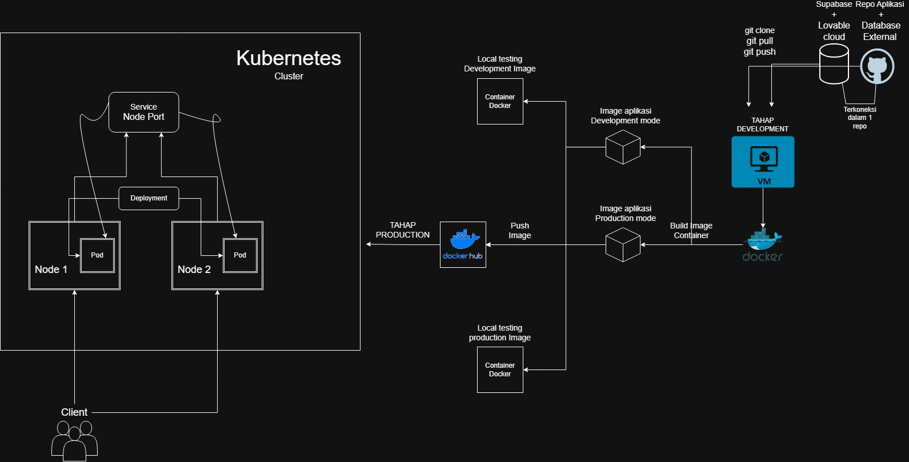
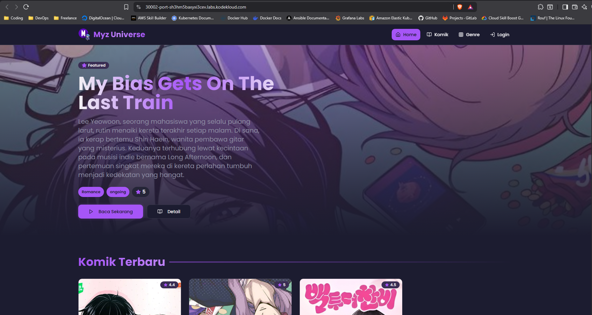
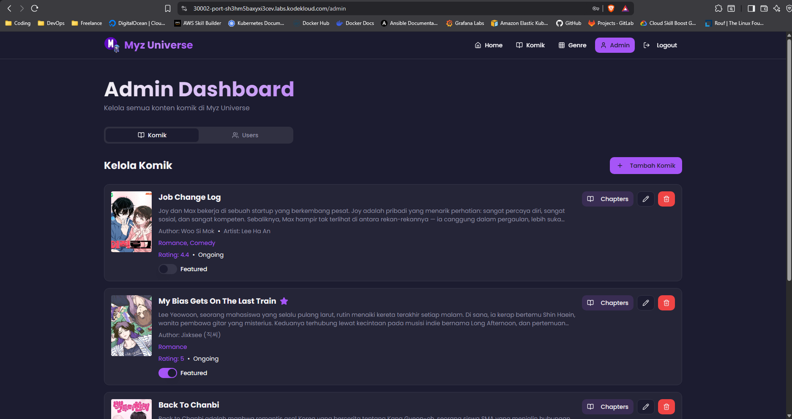

# Aplikasi Comic Reader
Proses deployment untuk aplikasi Comic Reader.

## TOPOLOGI PROJECT


1. Ringkasan Proyek
Aplikasi ini adalah sebuah platform pembaca komik berbasis web yang dibangun dengan antarmuka pengguna modern dan interaktif.

Arsitektur dan Teknologi
- Frontend: React, Vite, TypeScript

- UI/Styling: shadcn-ui, Tailwind CSS

- Backend/Database: Supabase (dikelola melalui layanan eksternal Lovable Cloud)

- Containerization: Docker

- Orchestration: Kubernetes
note: kode aplikasi di kelola oleh Ai Lovable dan Saya 

2. Deployment Workflow
Berikut rincian bagaimana saya melakukan management proyek ini.

- Containerization: Aplikasi dikemas sebagai image Docker menggunakan Dockerfile dengan menggunakan multi-stage build untuk optimasi ukuran dan keamanan.

- Tahap Build: Tahap pertama (builder) di dalam Dockerfile menggunakan base image node:18-alpine. Tahap ini bertanggung jawab untuk menginstal dependensi dan mengkompilasi aplikasi TypeScript/React menjadi aset statis (HTML, CSS, JS) di dalam direktori /dist.

- Tahap Produksi: Tahap kedua (production) menggunakan base image nginx:stable-alpine yang ringan. Hasil kompilasi (folder /dist) dari tahap builder disalin ke direktori root Nginx.

- Penyajian Konten: Nginx di dalam container bertugas menyajikan file statis tersebut, yang kemudian diekspos ke luar klaster melalui Service Kubernetes.

- Pengujian di lokal server. Sebelum diunggah, image Docker yang sudah jadi diuji secara lokal untuk memastikan container dapat berjalan tanpa masalah. Saya melakukan pengujian melalui VM local pribadi

- Jika image sudah bisa berjalan lancar di container saya melakukan push Image ke Docker Hub di repository saya

note berikut nama repository Docker Hub saya: https://hub.docker.com/u/mochabdulrouf

- Manifes Kubernetes: File manifes YAML (comic-deployment.yaml) disiapkan untuk mendefinisikan objek Deployment dan Service yang diperlukan.

- Deployment: Manifes diaplikasikan ke Cluster Kubernetes untuk memulai proses deployment.

- Pengujian: Aplikasi yang sudah berjalan diuji melalui NodePort yang telah ditentukan pada Service.

## Cara melakukan Deployment di Kubernetes

1. Menyiapkan file konfigurasi di server
```bash
vi comic-deployment.yaml
```

2. Isi file konfigurasinya
Contoh ada di file comic-deployment.yaml 

3. Lakukan Eksekusi menggunakan Command Declarative Management
```bash
kubectl apply -f comic-deployment.yaml
```

4. Cek apakah Deployment dan Service berjalan tanpa problem
```bash
kubectl get all
```

5. Pengujian saya akses ke EXTERNAL Port 30002 di file manifes, Untuk layanan Kubernetes saya menggunakan Playground KodeKloud untuk melakukan uji coba Production dan Implementasi sederhana. Visit ke website ini guys free main kubernetes buat device yang ga kuat https://kodekloud.com/studio/playgrounds/kubernetes/

## Documentation

1. File konfigurasi di eksekusi menggunakan command kubectl apply
```bash
controlplane ~/Production ➜  kubectl apply -f comic-deployment.yaml 
deployment.apps/comic-deployment created
service/comic-service created
```

2. Verifikasi apakah Deployment dan Service berjalan
```bash
controlplane ~/Production ➜  kubectl get all
NAME                                   READY   STATUS    RESTARTS   AGE
pod/comic-deployment-7c8bb954d-4xgws   1/1     Running   0          34s
pod/comic-deployment-7c8bb954d-j96b5   1/1     Running   0          34s
pod/comic-deployment-7c8bb954d-v6thr   1/1     Running   0          34s

NAME                    TYPE        CLUSTER-IP      EXTERNAL-IP   PORT(S)        AGE
service/comic-service   NodePort    172.20.21.109   <none>        80:30002/TCP   35s
service/kubernetes      ClusterIP   172.20.0.1      <none>        443/TCP        74m

NAME                               READY   UP-TO-DATE   AVAILABLE   AGE
deployment.apps/comic-deployment   3/3     3            3           36s

NAME                                         DESIRED   CURRENT   READY   AGE
replicaset.apps/comic-deployment-7c8bb954d   3         3         3       35s
```

3. Log ini menunjukan bahwa Pod berjalan dengan sehat dan normal tidak ada error atau bug, Nginx siap melayani traffic yang masuk
```bash
controlplane ~/Production ➜  kubectl logs comic-deployment-7c8bb954d-4xgws 
/docker-entrypoint.sh: /docker-entrypoint.d/ is not empty, will attempt to perform configuration
/docker-entrypoint.sh: Looking for shell scripts in /docker-entrypoint.d/
/docker-entrypoint.sh: Launching /docker-entrypoint.d/10-listen-on-ipv6-by-default.sh
10-listen-on-ipv6-by-default.sh: info: Getting the checksum of /etc/nginx/conf.d/default.conf
10-listen-on-ipv6-by-default.sh: info: Enabled listen on IPv6 in /etc/nginx/conf.d/default.conf
/docker-entrypoint.sh: Sourcing /docker-entrypoint.d/15-local-resolvers.envsh
/docker-entrypoint.sh: Launching /docker-entrypoint.d/20-envsubst-on-templates.sh
/docker-entrypoint.sh: Launching /docker-entrypoint.d/30-tune-worker-processes.sh
/docker-entrypoint.sh: Configuration complete; ready for start up
2025/10/15 07:26:49 [notice] 1#1: using the "epoll" event method
2025/10/15 07:26:49 [notice] 1#1: nginx/1.28.0
2025/10/15 07:26:49 [notice] 1#1: built by gcc 14.2.0 (Alpine 14.2.0) 
2025/10/15 07:26:49 [notice] 1#1: OS: Linux 5.15.0-1083-gcp
2025/10/15 07:26:49 [notice] 1#1: getrlimit(RLIMIT_NOFILE): 1048576:1048576
2025/10/15 07:26:49 [notice] 1#1: start worker processes
2025/10/15 07:26:49 [notice] 1#1: start worker process 77
2025/10/15 07:26:49 [notice] 1#1: start worker process 78
2025/10/15 07:26:49 [notice] 1#1: start worker process 79
2025/10/15 07:26:49 [notice] 1#1: start worker process 80
2025/10/15 07:26:49 [notice] 1#1: start worker process 81
2025/10/15 07:26:49 [notice] 1#1: start worker process 82
2025/10/15 07:26:49 [notice] 1#1: start worker process 83
2025/10/15 07:26:49 [notice] 1#1: start worker process 84
2025/10/15 07:26:49 [notice] 1#1: start worker process 85
2025/10/15 07:26:49 [notice] 1#1: start worker process 86
2025/10/15 07:26:49 [notice] 1#1: start worker process 87
2025/10/15 07:26:49 [notice] 1#1: start worker process 88
2025/10/15 07:26:49 [notice] 1#1: start worker process 89
2025/10/15 07:26:49 [notice] 1#1: start worker process 90
2025/10/15 07:26:49 [notice] 1#1: start worker process 91
2025/10/15 07:26:49 [notice] 1#1: start worker process 92
172.17.0.0 - - [15/Oct/2025:07:28:50 +0000] "GET /assets/logo-DzOAN2KB.png HTTP/1.1" 200 6524 "https://30002-port-sh3hm5baxyxi3cev.labs.kodekloud.com/" "Mozilla/5.0 (Windows NT 10.0; Win64; x64) AppleWebKit/537.36 (KHTML, like Gecko) Chrome/141.0.0.0 Safari/537.36" "182.8.227.3, 34.120.45.220, 169.254.169.126, 192.168.56.192"
```

4. Aplikasi di akses melalui browser menggunakan Port EXTERNAL 30002


5. Verifikasi Koneksi Database, Dengan cara login ke website menggunakan akun admin.Aplikasi ini terhubung ke database External yang di kelola oleh Lovable Cloud (Berbasis Supabase), Keberhasilan login sebagai Admin menunjukan bahwa Pod didalam Cluster Kubernetes memiliki koneksi ke layanan database external.



gacorr cuyy anak IT banget